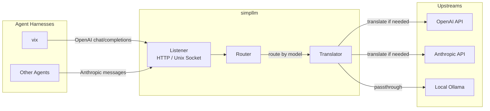

# simpllm

A local proxy for AI model requests. Runs on your machine — not a server. Sits between agent harnesses (like vix) and provider APIs (cloud, local).

## What it does

Agents send requests in whatever wire format they speak — OpenAI chat completions, OpenAI responses API, Anthropic messages — and simpllm routes them to the configured upstream. It can translate between formats, so an agent speaking OpenAI format can talk to an Anthropic upstream and vice versa.



## Why local

simpllm is not meant to be deployed on a server. It runs on your machine, on your laptop or home network. The reasoning:

**Route to local models as they get better.** As smaller models become more powerful, you'll want to direct some of your LLM interactions to your own hardware — a function-calling model on your machine, an Ollama box on your home network. simpllm makes that a config change, not an integration project.

**Intercept and own your conversations.** When traffic flows through simpllm on your machine, you can see it. Save threads to a central place, archive them, analyze them, do whatever you want with them. Your conversations stay under your control.

**One place to connect everything.** New agents, new providers, new models — they all connect through simpllm. Instead of wiring up each agent to each provider individually, you point them all at your local proxy. Switching from OpenAI to Anthropic or adding a local model is a config edit, not a code change.

## Endpoints

| Path | Wire Format | Description |
|------|-------------|-------------|
| `POST /v1/chat/completions` | OpenAI | Chat completions (standard) |
| `POST /v1/messages` | Anthropic | Messages API |
| `POST /v1/responses` | OpenAI | Responses API |
| `POST /v1/embeddings` | OpenAI | Embeddings |
| `POST /v1/images/generations` | OpenAI | Image generation |
| `GET /v1/models` | — | List configured models |
| `GET /health` | — | Health check |

## Quick start

```bash
# Build
go build -o simpllm ./cmd/simpllm

# Set your API keys in config (see config.example.yaml)
# Or store them in your system keyring:
#   macOS: security add-generic-password -a "$USER" -s "simpllm" -w
#   Linux: secret-tool store --application-name simpllm service simpllm username OPENAI_API_KEY

# Run
./simpllm -config config.yaml
```

## Config

Config is resolved by merging in order:
1. `~/.config/simpllm/config.yaml` — global defaults
2. `./.simpllm/config.yaml` — local overrides (merged on top)
3. `-config path` — explicit file, skips merge

Config supports `$ref` for keyring secrets. See `config.example.yaml`.

```yaml
listen:
  http: ":8080"
  unix: "/tmp/simpllm.sock"

models:
  - name: "gpt-4o"
    upstreams:
      - url: "https://api.openai.com/v1/chat/completions"
        headers:
          authorization:
            prefix: "Bearer "
            value:
              $ref: "#/secrets/OPENAI_API_KEY"   # from system keyring
        wire_format: "openai"

  - name: "claude-via-openai"
    upstreams:
      - url: "https://api.anthropic.com/v1/messages"
        headers:
          x-api_key:
            $ref: "#/secrets/ANTHROPIC_API_KEY"
        wire_format: "anthropic"
```

### Header values

Headers support three modes: **static**, **constructed (prefix-value-suffix)**, and **forwarded**.

#### Static

A plain string value, sent as-is on every request.

```yaml
headers:
  x-api-version: "2024-01-01"
  x-tenant-id: "org-42"
```

#### Constructed (prefix-value-suffix)

An object with a `value` field and optional `prefix`/`suffix` strings. The final header value is `prefix + value + suffix`. The `value` can be a literal string or a `$ref` to a keyring secret.

```yaml
headers:
  authorization:
    prefix: "Bearer "
    value: "sk-abc123"                   # literal value

  x-auth:
    prefix: "Token "
    value:
      $ref: "#/secrets/MY_TOKEN"         # resolved from system keyring

  x-tagged:
    prefix: "["
    suffix: "]"
    value: "request"                     # results in "[request]"
```

#### Forwarded

Copies the header value from the incoming client request and forwards it to the upstream. Useful for passing through client-specific headers (session IDs, trace context, etc.). If the client doesn't send the header, it is omitted. Can be combined with `prefix`/`suffix`.

```yaml
headers:
  x-opencode-session:
    forward: true                        # pass through from client

  x-trace:
    forward: true
    prefix: "proxy-"                     # forwarded value + prefix
```

## Secrets

API keys are stored in the system keyring (macOS Keychain, Linux Secret Service, Windows Credential Manager) and referenced in config with `$ref`:

```yaml
api_key:
  $ref: "#/secrets/OPENAI_API_KEY"
```

Secrets are fetched once at startup and cached in memory for the lifetime of the process.

## Wire formats

- **openai** — OpenAI chat completions (`/v1/chat/completions`)
- **anthropic** — Anthropic messages (`/v1/messages`)
- **openai_responses** — OpenAI responses API (`/v1/responses`)

Translation between formats is automatic when the downstream format differs from the upstream format.

## Unix socket

For zero-network-overhead local use:

```yaml
listen:
  unix: "/tmp/simpllm.sock"
```

```bash
curl --unix-socket /tmp/simpllm.sock http://localhost/v1/chat/completions \
  -H "Content-Type: application/json" \
  -d '{"model": "gpt-4o", "messages": [{"role": "user", "content": "hello"}]}'
```

## Testing

```bash
go test ./...
```
